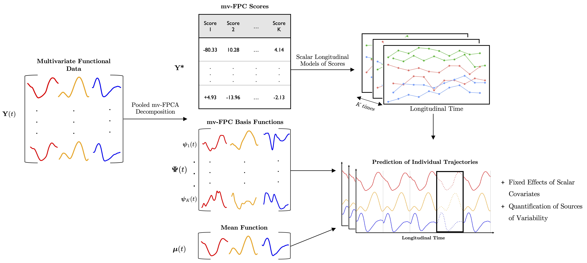

Code for the paper ‘A Multivariate Longitudinal Functional Model for
Repeatedly-Observed Human-Movement Data’
================

## Repository Structure:

------------------------------------------------------------------------

- :open_file_folder: **code**
  

  

  📁 <b>analysis</b> – scripts used to perform the data analysis.
  

  - :page_facing_up: [01 - Create Plot for
    Introduction](code/analysis/01-introduction-plot.R)
  - :page_facing_up: [02 - Create Plot of Stride
    Timings](code/analysis/02-strides-timing-plot.R)
  - :page_facing_up: [03 - Prepare Data for
    Analysis](code/analysis/03-data-preparation.R) ([extra
    figures](code/analysis/03-data-preparation-extra-plot.R))
  - :page_facing_up: [04 - Split Data into Test and Training
    Samples](code/analysis/04-test-train-split.R)
  - :page_facing_up: [05 - mv-FPCA basis
    Representation](code/analysis/05-basis-representation.R)
  - :page_facing_up: [06 - Linear Mixed Models of mv-FPCA
    Scores](code/analysis/06-scores-modelling.R) ([Extra
    Figures](code/analysis/06), [Bootstrap
    Resampling](code/analysis/06-bootstrap.R))
  - :page_facing_up: 07 - Individual Random Effects Analysis ([Script
    1](code/analysis/07-individual-fitted-mv-FPC1.R), [Script
    2](code/analysis/07-individual-analysis-predictions.R), [Script
    3](code/analysis/07-individual-analysis-test-error.R), [Script
    4](code/analysis/07-individual-analysis-changes.R))
  - :page_facing_up: 08 - Fixed Effects Analysis ([Script
    1](code/analysis/08-fixef-results-post-processing.R), [Script
    2](code/analysis/08-fixef-spline-coef.R))
    

    

    

    📁 <b>functions</b> – custom functions for modelling data analysis.
    

    - :page_facing_up: [Centering a (multivariate) object around a
      different mean](code/functions/center_fd_around_new_mean.R)
    - :page_facing_up: [Decentering a (multivariate) object around a
      different mean](code/functions/decenter_fd_around_new_mean.R)
    - :page_facing_up: [Helper functions for manipulating `fd`
      objects](code/functions/functions-helper-smoothing.R)
    - :page_facing_up: [Project (multivariate) functional data (`fd`
      object) onto (multivariate) FPCs (`pca.fd`
      object)](code/functions/project_data_onto_fpcs.R)  
    - :page_facing_up: [Computing the (%) of Variance Explained by a
      mv-FPCA
      reconstruction](code/functions/variance_explained_reconstruction.R)
    - :page_facing_up: [Custom theme for
      figures](code/functions/theme_gunning.R)
    - :page_facing_up: [Functions to generate data from a multilevel
      longitudinal design for the
      simulation](code/functions/generate_design.R)
    - :page_facing_up: [Generate data from a polynomial scalar
      longitudinal model for the
      simulation](code/functions/generate_polynomial_model_basis_coefficient.R)
    - :page_facing_up: [Generate multiple basis coefficients (i.e.,
      mv-FPC scores) from a polynomial scalar longitudinal model for the
      simulation](code/functions/generate-basis-coefficient-matrix.R)
    - :page_facing_up: [Construct an `fd` object by combining pca.fd
      object and matrix of PCA
      scores](code/functions/construct_fd_from_scores.R)
    - :page_facing_up: [Generate smooth Gaussian noise to add to
      simulated functional
      data](code/functions/function-generate-smooth-noise.R)
    - :page_facing_up: [Modified version of `pca.fd()` to choose $K$
      based on proportion of variance
      explained.](code/functions/pca.fd_pve_cutoff.R)
    - :page_facing_up: [Wrapper function to extract FPCA scores from a
      `pca.fd()` object and add them to a data
      frame.](code/functions/add_pca.fd_scores_to_df.R)
    - :page_facing_up: [Function to fit a polynomial scalar longitudinal
      model the to mv-FPC scores.](code/functions/fit_poly.R)
    - :page_facing_up: [Function to fit a “naive” model the to mv-FPC
      scores.](code/functions/fit_naive_spline_intercept.R)
    - :page_facing_up: [Function to fit a ml-FPCA model the to mv-FPC
      scores.](code/functions/fit_fpca.R)
    - :page_facing_up: [Function to fit a natural spline model the to
      mv-FPC scores.](code/functions/fit_spline.R)
    - :page_facing_up: [Reduced version of the above
      model.](code/functions/fit_spline_subject_ri_side.R)
    - :page_facing_up: [Function to calculate average integrated squared
      prediction error for functional
      observations.](code/functions/calculate_prediction_error.R)
    - :page_facing_up: [Function to calculate individual integrated
      squared prediction errors for functional
      observations.](code/functions/calculate_individual_prediction_errors.R)
    - :page_facing_up: [Convenience function to split data into train
      and test in simulation.](code/functions/split_train_test.R)
    - :page_facing_up: [Convenience function to load all functions
      needed in the
      simulation.](code/functions/source_all_simulation_functions.R)
    - :page_facing_up: [Convenience function to add polynomial terms to
      a data frame.](code/functions/add_poly_to_df.R)
    - :page_facing_up: [Convenience function to add natural spline terms
      to a data frame.](code/functions/add_natural_splines_to_df.R)
    - :page_facing_up: [Function to extract fixed-effects coefficients
      from a list of fitted `lmerMod`
      objects.](code/functions/extract_fixef_coef.R)
    - :page_facing_up: [Conveninence function to load all functions for
      data analysis.](code/functions/source_all_analysis_functions.R)
    - :page_facing_up: [Conveninence functions for post processing
      results.](code/functions/post-processing-functions.R)
    - :page_facing_up: [Function to calculate rate of change in
      longitudinal direction](code/functions/calculate_rate_of_change.R)
    - :page_facing_up: [Function to do bootstrap of
      subjects](code/functions/bootstrap_of_subjects.R)
    - :open_file_folder: **tests** – some basic tests for the custom
      functions.
      - :page_facing_up: [Test for
        `center_fd_around_new_mean()`](code/functions/tests/test-center_fd_around_new_mean.R)
      - :page_facing_up: [Test for
        `decenter_fd_around_new_mean()`](code/functions/tests/test-decenter_fd_around_new_mean.R)
      - :page_facing_up: [Test for
        `variance_explained_reconstruction()`](code/functions/tests/test-variance-explained-reconstruction.R)
      - :page_facing_up: [Test for
        `generate_design_multiple_subjects()`](code/functions/tests/test-generate-design.R)
      - :page_facing_up: [Test for
        `generate_polynomial_model_basis_coefficient()`](code/functions/tests/test-generate_polynomial_model_basis_coefficient.R)
      - :page_facing_up: [Test 1 for
        `generate_basis_coefficient_matrix()`](code/functions/tests/test-generate-basis-coefficient-matrix-01.R)
      - :page_facing_up: [Test 2 for
        `generate_basis_coefficient_matrix()`](code/functions/tests/test-generate-basis-coefficient-matrix-02.R)
      - :page_facing_up: [Test for
        `construct_fd_from_scores()`](code/functions/tests/test_construct_fd_from_scores.R)
      - :page_facing_up: [Tests for
        `calculate_rate_of_change()`](code/functions/tests/test_calculate_rate_of_change.R)
      - :page_facing_up: [Tests for
        `calculate_individual_prediction_errors()`](code/functions/tests/test_calculate_individual_prediction_errors.R)
      - :page_facing_up: [Tests for
        `bootstrap_of_subjects()`](code/functions/tests/test_bootstrap_of_subjects.pdf)
        

- :open_file_folder: **outputs**
  - :open_file_folder: **tables** – tables containing data-analysis
    results. Some are stored as `.csv` files while others have been
    exported to $TeX$ using `{xtable}` for inclusion in the paper.
  - :open_file_folder: **figures** – figures for the manuscript, all
    created in $TeX$ using `{tikzDevice}` and linked to overleaf, where
    the file [figures.tex](outputs/figures/figures.tex) compiles all the
    individual $TeX$ files.
  - 💾 also contains `.rds` objects saved at various stages of the data
    analysis
  - :open_file_folder: **data** – contains the main dataset used in
    analysis and small data sets used to create the introduction and
    stride-timing plots (not publicly available).

## Reproducibility

`sessionInfo()` from the model fit:

    ## R version 4.1.2 (2021-11-01)
    ## Platform: x86_64-apple-darwin17.0 (64-bit)
    ## Running under: macOS Monterey 12.2.1
    ## 
    ## Matrix products: default
    ## LAPACK: /Library/Frameworks/R.framework/Versions/4.1/Resources/lib/libRlapack.dylib
    ## 
    ## locale:
    ## [1] en_IE.UTF-8/en_IE.UTF-8/en_IE.UTF-8/C/en_IE.UTF-8/en_IE.UTF-8
    ## 
    ## attached base packages:
    ## [1] parallel  splines   stats     graphics  grDevices utils     datasets 
    ## [8] methods   base     
    ## 
    ## other attached packages:
    ##  [1] refund_0.1-26     progress_1.2.2    lme4_1.1-30       data.table_1.14.2
    ##  [5] fda_5.5.1         deSolve_1.30      fds_1.8           RCurl_1.98-1.6   
    ##  [9] rainbow_3.6       pcaPP_1.9-74      MASS_7.3-55       Matrix_1.4-0     
    ## 
    ## loaded via a namespace (and not attached):
    ##  [1] mclust_5.4.9       Rcpp_1.0.10        here_1.0.1         mvtnorm_1.1-3     
    ##  [5] lattice_0.20-45    prettyunits_1.1.1  assertthat_0.2.1   rprojroot_2.0.2   
    ##  [9] digest_0.6.29      utf8_1.2.2         R6_2.5.1           magic_1.6-0       
    ## [13] evaluate_0.15      pracma_2.3.8       ggplot2_3.4.2      pillar_1.7.0      
    ## [17] rlang_1.1.1        rstudioapi_0.13    minqa_1.2.4        nloptr_2.0.0      
    ## [21] grpreg_3.4.0       rmarkdown_2.11     desc_1.4.1         munsell_0.5.0     
    ## [25] gamm4_0.2-6        compiler_4.1.2     xfun_0.29          pbs_1.1           
    ## [29] pkgconfig_2.0.3    mgcv_1.8-38        htmltools_0.5.2    tidyselect_1.1.1  
    ## [33] tibble_3.1.6       hdrcde_3.4         fansi_1.0.2        crayon_1.5.0      
    ## [37] dplyr_1.0.8        brio_1.1.3         bitops_1.0-7       grid_4.1.2        
    ## [41] nlme_3.1-155       gtable_0.3.0       lifecycle_1.0.3    DBI_1.1.2         
    ## [45] magrittr_2.0.2     scales_1.2.1       KernSmooth_2.23-20 cli_3.6.0         
    ## [49] testthat_3.1.4     ellipsis_0.3.2     vctrs_0.5.1        generics_0.1.2    
    ## [53] boot_1.3-28        tools_4.1.2        glue_1.6.2         purrr_0.3.4       
    ## [57] hms_1.1.1          ks_1.13.4          pkgload_1.3.0      abind_1.4-5       
    ## [61] fastmap_1.1.0      yaml_2.3.5         colorspace_2.0-3   cluster_2.1.2     
    ## [65] RLRsim_3.1-6       knitr_1.37
